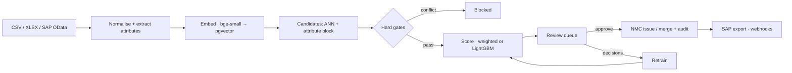

# EkCode — One Nation, One Material Code

**AI-driven National Unified Material Master for Indian CPSEs**
Smart India Hackathon 2026 · Ministry of Petroleum & Natural Gas

CPSEs in Oil & Gas, Power, Steel, Mining and Heavy Engineering each keep their own SAP/ERP material master. The same bolt is `10045872 · HEX BOLT M12X50 SS304` at IOCL, `3000211 · Bolt hexagonal SS 12x50mm` at ONGC and `MT-88213 · SS HX BLT M12 L50` at BPCL. The result is duplicate inventory, fragmented spend and no demand aggregation.

EkCode reads every CPSE's export and finds identical, near-duplicate and functionally equivalent materials. For each one it proposes a standard noun-modifier description and a **National Material Code** (`NMC-CCCC-SSSSSS-K`, with a check digit). Every step keeps a human in the loop and an audit trail, and the result goes back to SAP.

---

## What it does

| | |
|---|---|
| **Ingest** | CSV/TSV/XLSX upload or live SAP OData pull. Columns are auto-mapped to `MATNR, MAKTX, LONG_TEXT, MEINS, MATKL, PRICE, QTY`, with live progress. Re-uploads only process rows that changed. |
| **Understand** | Normalises text (abbreviations, inch ↔ NB/DN, UN/ECE units). Extracts noun, thread, length, size, rating, schedule, grade, standard, bearing number and cable specs, each with a confidence. An LLM can optionally fill gaps. |
| **Match** | Candidates come from pgvector ANN plus attribute blocking. Pairs are scored on six features with a weighted formula, or with a LightGBM model learned from steward decisions. |
| **Never merge different things** | Deterministic hard gates block M12 vs M16, 150# vs 300#, SS304 vs SS316 (and 316 vs 316L), stud vs hex bolt, copper vs aluminium, whatever the score. |
| **Review** | Keyboard-first queue (`A` approve, `R` reject, `J`/`K` move), highest spend × uncertainty first. Side-by-side diff with "why" chips, bulk actions, and a "blocked by rule" tab. |
| **Code** | Approval issues or merges national codes in one audited transaction. Merged codes are deprecated, never deleted, and point to their successor. |
| **Explore** | National master, find-equivalent search, knowledge graph, analytics (duplicates, categories, and aggregation opportunities with savings at the best price paid). |
| **Integrate** | SAP-format mapping export per CPSE, read-only API keys, HMAC-signed webhooks. |
| **Learn** | Every decision becomes a label: retrain LightGBM, compare metrics, activate or roll back. |

## Quick start

Needs Docker Desktop (Windows needs WSL 2). Full guide: **[docs/SETUP.md](docs/SETUP.md)**.

```bash
cp .env.example .env                 # set JWT_SECRET and ADMIN_PASSWORD
docker compose up -d --build         # first build: 5–15 minutes
```

Open **http://localhost:8080** and sign in with `ADMIN_EMAIL` / `ADMIN_PASSWORD` from `.env`. The API docs are at http://localhost:8000/api/docs.

Demo data (six CPSEs, clearly labelled *Synthetic*):
```bash
docker compose exec api python scripts/generate_cpse_seed.py
docker compose exec api python scripts/load_seed.py --simulate-review 0.5 --promote-singletons
docker compose exec api python scripts/evaluate.py
```

No API keys are required; it runs fully offline. Optional keys (Ollama, Gemini, Groq, SAP sandbox) are explained in [docs/API_KEYS_AND_SOURCES.md](docs/API_KEYS_AND_SOURCES.md).

## Five-minute demo

1. **Upload data**: IOCL, `test_upload_IOCL.csv`. The columns are mapped automatically; press *Start processing* and watch the stages.
2. Upload `test_upload_ONGC.csv` for ONGC.
3. **Review matches**: `SS HX BLT M12 L50` (ONGC) is suggested as the same material as `HEX BOLT M12X50 SS304` (IOCL). Press **A** and a national code is issued.
4. Open the **Blocked by rule** tab: the M16 bolt and the 300# valve look almost identical to the IOCL items, but they are blocked and can never be merged.
5. **National master** → the new NMC: its attributes, valid check digit, both legacy codes and the audit history. Then open **Knowledge graph**.
6. **Find equivalent**: paste `Bolt hexagonal SS 12x50mm` and see which code it maps to, and why.
7. **Integrations → SAP mapping export**: download the IOCL mapping for SAP.
8. **Analytics** and **Audit trail**: every number and every change comes from the database.

## How it works



| Layer | Technology |
|---|---|
| Web | React 19, Vite, JSX, Tailwind CSS v4 (CSS-first "Tiranga Glass" design), Motion, TanStack Query, Recharts, React Flow |
| API | FastAPI, SQLAlchemy 2, cookie JWT + roles, SSE progress |
| Data | PostgreSQL 16 + pgvector + pg_trgm: the single store for materials, vectors, pairs, codes, graph edges and audit |
| Jobs | Redis + RQ worker (ingest, SAP pull, retrain, rescore, webhooks) |
| ML | Local `BAAI/bge-small-en-v1.5` embeddings, rule-based attribute extraction, LightGBM, optional LLM (noop / Ollama / Gemini / Groq) |
| Run | Docker Compose; Nginx serves the app and proxies `/api` |

The decisions and their trade-offs are in [docs/DECISIONS.md](docs/DECISIONS.md), and the pipelines and transactions in [docs/FLOW.md](docs/FLOW.md).

## Measuring accuracy

The targets are in the PRD: pairwise F1 ≥ 0.90 (G1), precision ≥ 0.97 above the auto threshold, and 100% of hard negatives blocked (G2). `scripts/evaluate.py` measures all three on the seeded ground truth after the seed data has gone through the real pipeline; `--strict` makes it a CI gate. `scripts/load_wdc_benchmark.py` adds an independent check on the public WDC Products benchmark.

## Roles

| Role | Can |
|---|---|
| Admin | Everything: users, thresholds, dictionary, models, API keys, webhooks |
| Data steward | Review, approve, reject, edit national codes, issue codes, SAP pull |
| CPSE user | Upload and export for their own CPSE; browse and search |
| Auditor | Read everything, including the audit trail; change nothing |

## Security

- Passwords are hashed with argon2. Users can change their own password (key icon in the top bar); doing so signs out every other session.
- Sessions use JWT in an httpOnly `SameSite=Lax` cookie; the API refuses a weak secret in production.
- Every route enforces its role on the server.
- Logins and password changes are throttled, and an unknown email takes as long to reject as a wrong password.
- The audit trail is append-only and written in the same transaction as the change.
- Uploads are size-capped and saved under random names; malformed CSV lines are skipped and reported instead of failing the file. Exports are escaped against spreadsheet formula injection.
- API responses are sent with `Cache-Control: no-store`. A clash between two users editing the same record returns 409 (try again), and a database outage returns 503 instead of a stack trace.
- The backend runs as a non-root user; Postgres and Redis are bound to localhost. Nginx adds a strict Content-Security-Policy (no inline scripts) and the other security headers.
- No data leaves the server with `LLM_PROVIDER=noop` or `ollama`.

## Repository

```
backend/   FastAPI app (app/), ML package (ekml/), scripts/, tests/
frontend/  React app (src/), Playwright test (e2e/)
docs/      PRD, DECISIONS, FLOW, SETUP, REQUIREMENTS, API_KEYS_AND_SOURCES, DATA_SOURCES, CHANGELOG
test_upload_IOCL.csv, test_upload_ONGC.csv   sample files for the demo
```

## Documentation

| Document | For |
|---|---|
| [docs/SETUP.md](docs/SETUP.md) | Installing, starting, testing, troubleshooting |
| [docs/REQUIREMENTS.md](docs/REQUIREMENTS.md) | Hardware, software and packages |
| [docs/API_KEYS_AND_SOURCES.md](docs/API_KEYS_AND_SOURCES.md) | Optional keys and reference data |
| [docs/DATA_SOURCES.md](docs/DATA_SOURCES.md) | Where every dataset comes from, and its terms |
| [docs/PRD.md](docs/PRD.md) | Goals, requirements, match types, risks, glossary |
| [docs/DECISIONS.md](docs/DECISIONS.md) | Architecture decision records |
| [docs/FLOW.md](docs/FLOW.md) | Pipeline, approve transaction, state machines |
| [docs/CHANGELOG.md](docs/CHANGELOG.md) | What was built, step by step, and what changed from the reference |

## Beyond v1

Hindi and other Indian-language descriptions, Kubernetes/Helm, a cross-encoder re-ranker, ministry SSO, and audit-log partitioning.
