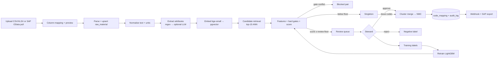
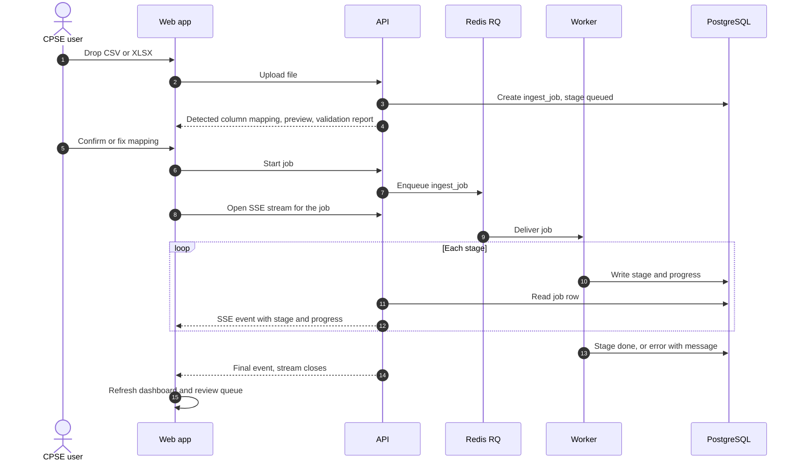
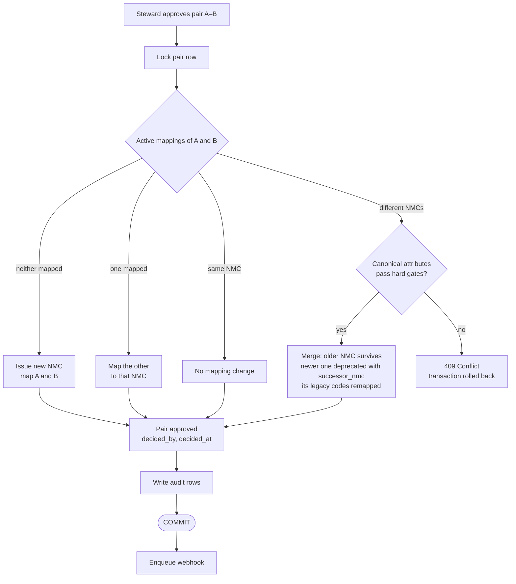
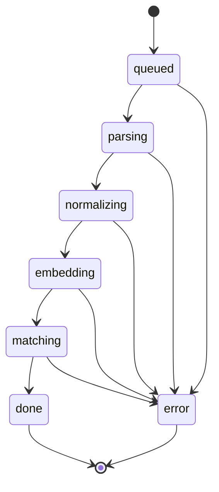
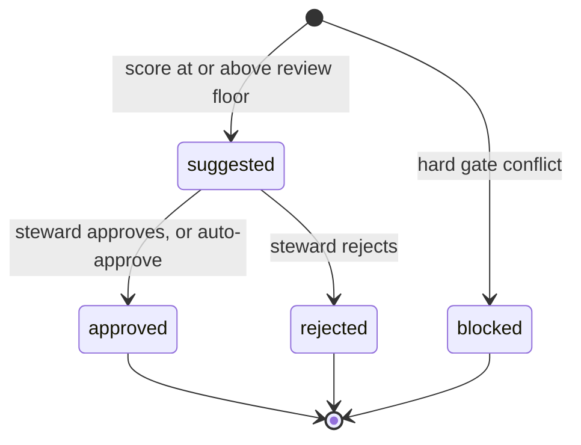
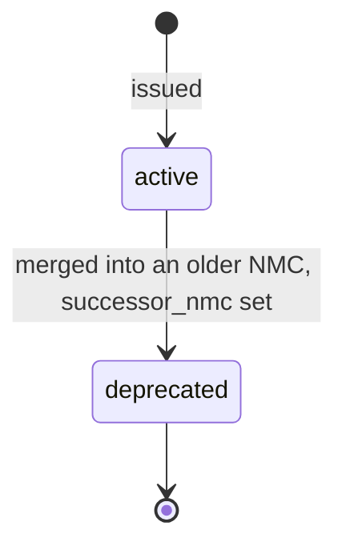
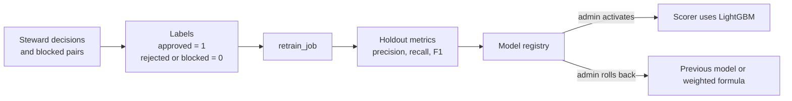

# EkCode — System Flows

How data moves through EkCode: the runtime architecture, the matching pipeline, the approve transaction and the state machines. For the reasoning behind these choices see [DECISIONS.md](DECISIONS.md); for requirements see [PRD.md](PRD.md).

---

## 1. Architecture

```
 React 19 + Vite (JSX, Tailwind v4, Motion, TanStack Query)
        │  /api  (Vite proxy in dev, Nginx in prod) — cookie auth
        ▼
 FastAPI (REST + SSE) ──► PostgreSQL 16 + pgvector + pg_trgm   (single source of truth, graph edges too)
        │
        ├──► Redis ──► RQ workers: ingest_job, retrain_job, webhook_job, sap_pull_job
        ├──► ekml (Python package): normalize · extract · embed(bge-small) · features · gates · score(LightGBM) · explain · nmc · taxonomy
        └──► LLM provider (noop | ollama | gemini | groq)  — optional
```

| Service | Runs as | Responsibility |
|---|---|---|
| `web` | Nginx serving the Vite build | The single-page app; proxies `/api` to the API with buffering off for SSE. |
| `api` | FastAPI | REST and SSE endpoints, auth and roles, interactive search, the approve transaction. |
| `worker` | RQ worker, same image as `api` | `ingest_job`, `retrain_job`, `webhook_job`, `sap_pull_job`. |
| `db` | PostgreSQL 16 with pgvector and pg_trgm | All business state: materials, vectors, pairs, NMCs, mappings, audit, settings, models, jobs. |
| `redis` | Redis | Job queue only. No business state. |
| `ollama` | Optional, Compose profile `llm` | Local LLM when `LLM_PROVIDER=ollama`. |
| `ekml` | Python package imported by `api` and `worker` | normalize, extract, embed, features, gates, score, explain, standardize, nmc, taxonomy, llm, train. |

---

## 2. Matching pipeline



| Step | What happens | Code |
|---|---|---|
| Column mapping | Headers are fuzzy-matched to `MATNR, MAKTX, LONG_TEXT, MEINS, MATKL, PRICE, QTY`; the user confirms or corrects before the job starts. | `services/ingest_service.py` |
| Parse + upsert | Rows are validated and upserted on CPSE + legacy code; a validation report lists rejected rows. | `services/ingest_service.py` |
| Normalize | Lowercase, strip punctuation, expand abbreviations, convert inches to mm, map UoM to UN/ECE Rec 20. | `ekml/normalize.py` |
| Extract | Noun and attributes by regex, each with a confidence; the optional LLM fills gaps and is validated. | `ekml/extract.py`, `ekml/llm.py` |
| Embed | bge-small vectors, written to pgvector in batches. | `ekml/embed.py` |
| Retrieve | Top-15 nearest neighbours by cosine distance, plus top-15 items with the same noun and sizes (JSONB containment on a GIN index). Embeddings barely see numbers, so the attribute block keeps the true twin in the candidate set when many look-alike items exist. | `services/match_service.py` |
| Score | Six features, hard gates, then the weighted formula or the active LightGBM model; the match type and explanation chips are stored with the pair. | `ekml/features.py`, `gates.py`, `score.py`, `explain.py` |
| Route | Gate conflict → `blocked`. Score at or above the review floor → `suggested`. Below the floor → the material stays a singleton for now. | `services/match_service.py` |

The review floor and auto threshold are runtime settings (Settings page), not constants in code.

---

## 3. Ingest job with live progress



Progress lives in the database, not in the API process, so a page reload or an API restart re-attaches to the same job.

---

## 4. Approve transaction

Everything in steps 1–5 happens in a single database transaction.

1. Lock pair row.
2. Find mappings of A and B.
3. Neither mapped → issue NMC, map both. One mapped → map the other. Both mapped to different NMCs → gate-check canonical attributes → merge (older survives, other deprecated with `successor_nmc`) or 409 conflict.
4. Pair `approved`, `decided_by`, `decided_at`.
5. Audit rows.
6. Enqueue webhook.

Two details that keep this correct:

- **Both already on the same NMC:** no mapping changes; the pair is simply marked approved and audited.
- **Webhook after commit:** step 6 runs only after the transaction commits, so a rolled-back approval never fires a webhook and the worker never reads uncommitted data.



### Other decisions

- **Reject:** the pair becomes `rejected`, no mapping changes, an audit row is written, and the pair becomes a negative training label.
- **Bulk approve or reject:** each pair runs through the same single-pair transaction. The response reports success or conflict per pair, so one conflict does not undo the rest of the batch.
- **Issue codes for unique materials:** every processed material with no active mapping and no open `suggested` pair receives its own NMC, with audit rows, in one action.
- **Auto-approve (opt-in, ADR-19):** `EXACT_DUPLICATE` pairs above the auto threshold that passed every gate go through the same approve transaction with actor `system`.

---

## 5. States

- `ingest_job.stage`: `queued → parsing → normalizing → embedding → matching → done | error`
- `match_pair.status`: `suggested → approved | rejected`, or `blocked` (gate conflict, never merge)
- `national_material.status`: `active → deprecated`

### 5.1 Ingest job

Attribute extraction runs inside the `normalizing` stage.



### 5.2 Match pair



`blocked` is final: a blocked pair is shown in the "Blocked by hard gate" tab for transparency but can never be approved.

### 5.3 National material



A deprecated NMC keeps resolving: lookups follow `successor_nmc` to the active code (ADR-20).

---

## 6. Continuous learning



Until a model is active, scoring uses the weighted formula. Hard gates run before whichever scorer is active.

---

## 7. Integration flows

- **SAP mapping export:** per CPSE, a CSV or XLSX file mapping each legacy `MATNR` to its active NMC with the standard description and status, ready to load into SAP.
- **SAP OData pull:** `sap_pull_job` pages through `API_PRODUCT_SRV` (`A_Product` and its descriptions), maps `Product` → `MATNR`, `ProductDescription` → `MAKTX`, `BaseUnit` → `MEINS`, `ProductGroup` → `MATKL`, and continues through the same pipeline from "Parse + upsert".
- **Webhooks:** after the change has committed, each event fans out to one RQ job per interested hook, so a slow receiver never delays another. The body is `{"id", "event", "sent_at", "data"}`, signed with HMAC-SHA256 over the raw body (`X-EkCode-Signature: sha256=…`), with `X-EkCode-Delivery` carrying the id so receivers can drop replays. A non-2xx answer is retried after 10 s, 1 min and 5 min (the worker runs with `--with-scheduler`).
- **Stalled jobs:** every stage change updates `ingest_job.updated_at`. A queued or running job with no progress for `STALE_JOB_MINUTES` (default 30) is shown as *stalled* and can be restarted with the same column mapping. Rows already processed are skipped on the second run (ADR-16).
- **API keys:** machine clients authenticate with a key that is shown once and stored only as a hash (ADR-10).
